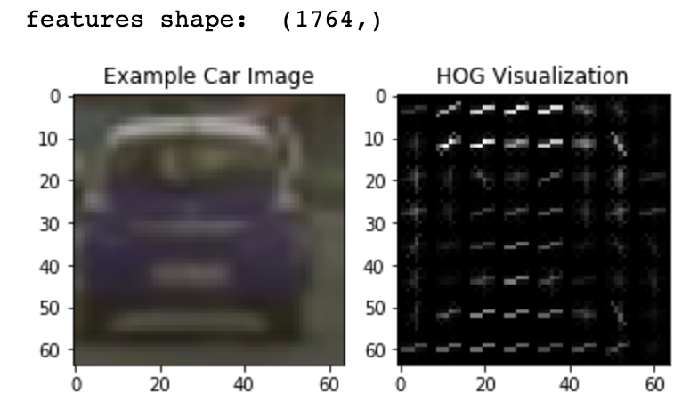
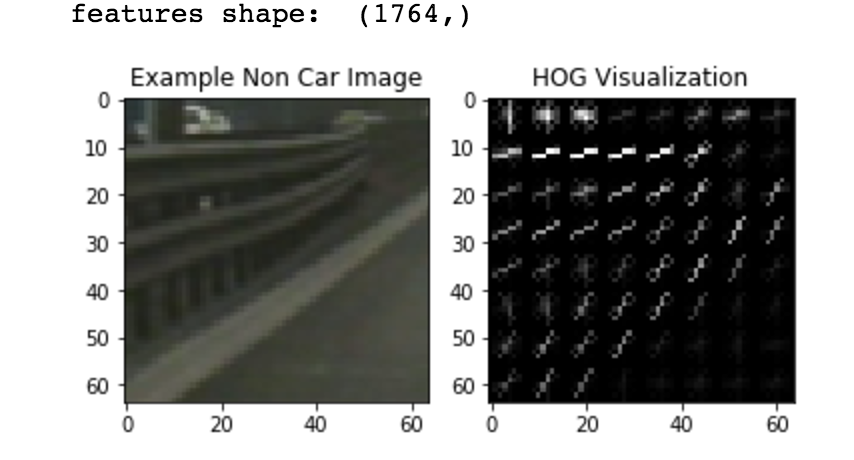
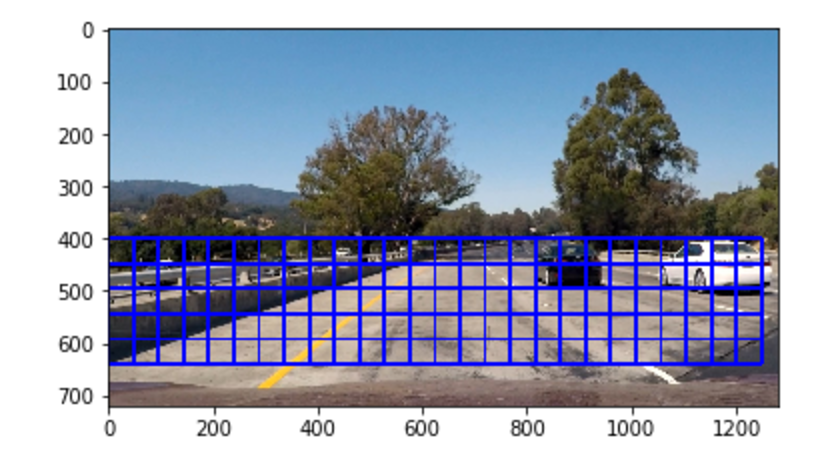
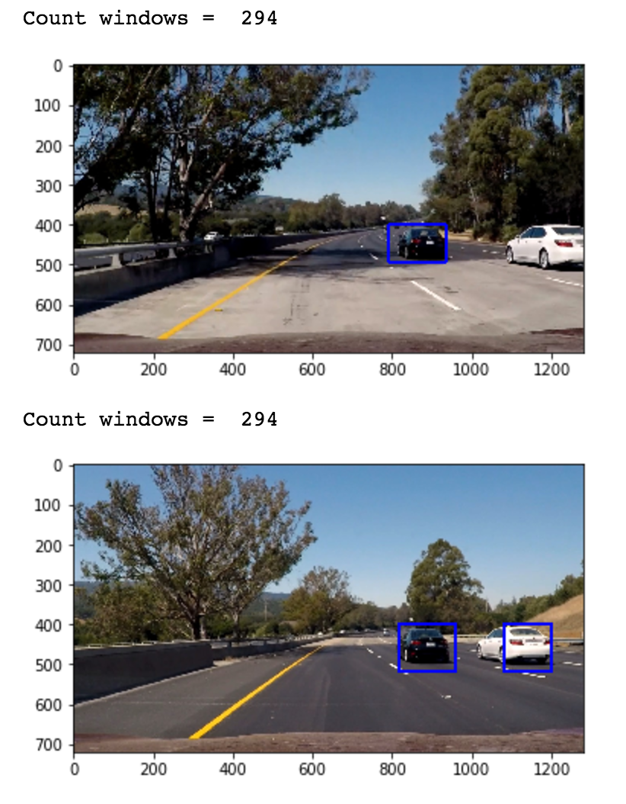
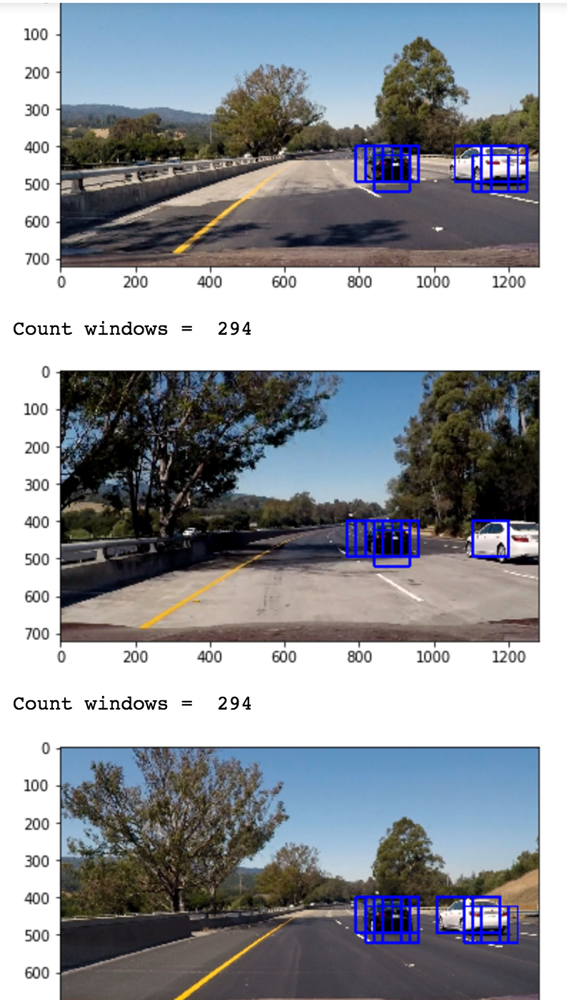
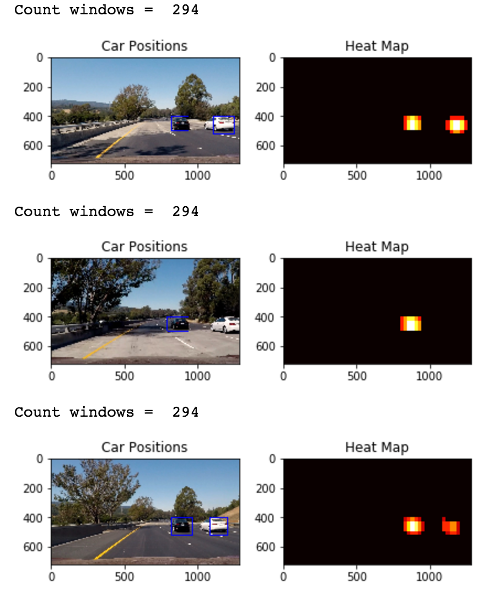

**Vehicle Detection Project**

The goals / steps of this project are the following:

* Perform a Histogram of Oriented Gradients (HOG) feature extraction on a labeled training set of images and train a classifier Linear SVM classifier
* Optionally, you can also apply a color transform and append binned color features, as well as histograms of color, to your HOG feature vector. 
* Note: for those first two steps don't forget to normalize your features and randomize a selection for training and testing.
* Implement a sliding-window technique and use your trained classifier to search for vehicles in images.
* Run your pipeline on a video stream (start with the test_video.mp4 and later implement on full project_video.mp4) and create a heat map of recurring detections frame by frame to reject outliers and follow detected vehicles.
* Estimate a bounding box for vehicles detected.

###Histogram of Oriented Gradients (HOG)

####1. Explain how (and identify where in your code) you extracted HOG features from the training images.

Please refer to cell 2 and 4 which demonstrates how HOG features where calculated.

I used a Linear SVM classifier for classification. Please refer to cells [5-8] for the demostration.

####2. Explain how you settled on your final choice of HOG parameters.
I used all the 3 channels for color space = 'YCrRb' for feature generation for HOG, and color_hist feature.
This gave a classifier with better accuracy compared to other color spaces.

####3. Describe how (and identify where in your code) you trained a classifier using your selected HOG features (and color features if you used them).
I used a Linear SVM classifier for classification. Please refer to cells [5-8] for the demostration.
I used HOG, color_hist and spatial_hist for the creation the feature vector.

###Sliding Window Search

####1. Describe how (and identify where in your code) you implemented a sliding window search.  How did you decide what scales to search and how much to overlap windows?

I just used a scale = 1.5. No other scales were used.

Please refer to cells [9-14] for the code and the demonstration.

####2. Show some examples of test images to demonstrate how your pipeline is working.  What did you do to optimize the performance of your classifier?

Ultimately I searched on two scales using YCrCb 3-channel HOG features plus spatially binned color and histograms of color in the feature vector, which provided a nice result.  Here are some example images:

Here "Count Windows" refers to the number of windows searched in that frame. 

### Video Implementation

####1. Provide a link to your final video output.  Your pipeline should perform reasonably well on the entire project video (somewhat wobbly or unstable bounding boxes are ok as long as you are identifying the vehicles most of the time with minimal false positives.)
[Here's the link](https://github.com/sd37/CarND-Vehicle-Detection/blob/master/project_video_soln_final.mp4)

####2. Describe how (and identify where in your code) you implemented some kind of filter for false positives and some method for combining overlapping bounding boxes.

I recorded the positions of positive detections in each frame of the video.  From the positive detections I created a heatmap and then thresholded that map to identify vehicle positions.  I then used `scipy.ndimage.measurements.label()` to identify individual blobs in the heatmap.  I then assumed each blob corresponded to a vehicle.  I constructed bounding boxes to cover the area of each blob detected.  

Here's an example result showing the heatmap from a series of frames of video, the result of `scipy.ndimage.measurements.label()` and the bounding boxes then overlaid on the last frame of video:

### Here are three frames with their corresponding predicted bounding boxes, thresholded heatmaps and the final bounding boxes:

Predicted bounding boxes.

Thresholded heatmaps for the above images with the final bounding boxes drawn using labels()

---

###Discussion

####1. Briefly discuss any problems / issues you faced in your implementation of this project.  Where will your pipeline likely fail?  What could you do to make it more robust?

I was previously using RGB color space, but somebody recommended on the forum to use the YCrCb color space which improved the detection greatly.

Secondly, dealing with .png files and scaling caused some problems. I decided to be consistent and use cv2.imread() everywhere, because it scaled .png 

images between (0, 255)

I didn't implementing the averaging of heatmaps over X number of frames. Not doing may cause spurious detections sometimes. However this was not necessary to to well on project_video.mp4 IMO. 

